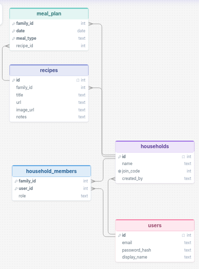
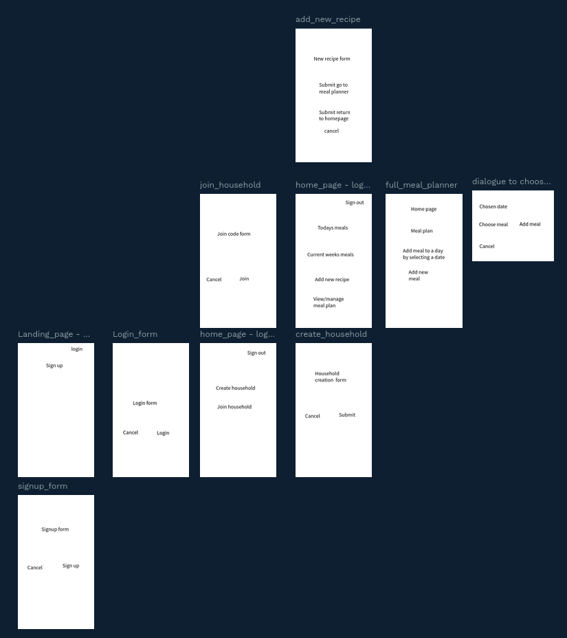

# Sprint 1 - Developing a DB and UI Prototype

## Sprint Goals

Develop a design for the database and a UI prototype that 
simulates the key functionality of the system. Test and 
refine the UI so that it can serve as the model for the next 
phase of development in Sprint 2.

### Specific Goals

- Design the database:
    - Tables
    - Fields / types
    - Primary keys
    - Default / nullable values
    - Relationships (foreign keys)
- Design the UI
    - Key pages
    - User interactions and 'flow'
    - Page layouts / features
    - Colour palette
    - Etc.

## Initial Database Design

Decided against shopping list functionality 

Family members is a linking table between users and household members

### Required Data Input

The system will accept the following data from users:

- User account information: Email address, password, and display name entered during registration.
- Household information: Household name and automatically generated join code when creating a household.
- Household membership: Join code entered by users to join an existing household, along with their assigned role.
- Recipe information: Recipe title, URL, image URL, and optional notes entered by household members.
- Meal plan information: Date, meal type (e.g., breakfast, lunch, dinner), and the selected recipe for each planned meal.

Most will be entered manually through forms, IDs and timestamps will be generated by the database.

### Required Data Output

- User profile information (display name and associated household).
- Household details, including household name and join code.
- A list of household members.
- A collection of saved recipes for the household, including titles, images, links, and notes.
- A meal planner/calendar showing meals scheduled for each date and meal type.
- Recipe details when selected from the recipe list or meal planner.

### Required Data Processing

- Authenticating users using their email address and password hash.
- Generating and validating unique household join codes.
- Linking users to households through the household members table.
- Storing and retrieving recipes that belong only to a user's household.
- Associating recipes with specific dates and meal types in the meal planner.
- Using SQL queries and table relationships (foreign keys) to retrieve related information, such as displaying all recipes for a household or showing the      recipe assigned to a particular meal.

## UI 'Flow'

The first stage of prototyping was to explore how the UI might 'flow' between states, based on the required functionality.

This Penpot demo shows the initial design for the UI 'flow':

https://design.penpot.app/#/view?file-id=5ab5eb30-5b3a-81d5-8008-296de403f502&page-id=5ab5eb30-5b3a-81d5-8008-296de403f503&section=interactions&frame-id=cfa2d32d-939c-80e5-8008-39090b61908f&index=0&share-id=696916e9-ba66-80aa-8008-55be7e5b26db
  

### Testing

Replace this text with notes about what you did to test the UI flow and the outcome of the testing.

### Changes / Improvements

Replace this text with notes any improvements you made as a result of the testing.

*IMPROVED FIGMA FLOW - PLACE THE FIGMA EMBED CODE HERE - MAKE SURE IT IS SET SO THAT EVERYONE CAN ACCESS IT*

## Initial UI Prototype

The next stage of prototyping was to develop the layout for each screen of the UI.

This Figma demo shows the initial layout design for the UI:

*FIGMA PROTOTYPE - PLACE THE FIGMA EMBED CODE HERE - MAKE SURE IT IS SET SO THAT EVERYONE CAN ACCESS IT*

### Testing

Replace this text with notes about what you did to test the UI flow and the outcome of the testing.

### Changes / Improvements

Replace this text with notes any improvements you made as a result of the testing.

*FIGMA IMPROVED PROTOTYPE - PLACE THE FIGMA EMBED CODE HERE - MAKE SURE IT IS SET SO THAT EVERYONE CAN ACCESS IT*

## Refined UI Prototype

Having established the layout of the UI screens, the prototype was refined visually, in terms of colour, fonts, etc.

This Figma demo shows the UI with refinements applied:

*FIGMA REFINED PROTOTYPE - PLACE THE FIGMA EMBED CODE HERE - MAKE SURE IT IS SET SO THAT EVERYONE CAN ACCESS IT*

### Testing

Replace this text with notes about what you did to test the UI flow and the outcome of the testing.

### Changes / Improvements

Replace this text with notes any improvements you made as a result of the testing.

*FIGMA IMPROVED REFINED PROTOTYPE - PLACE THE FIGMA EMBED CODE HERE - MAKE SURE IT IS SET SO THAT EVERYONE CAN ACCESS IT*

## Sprint Review

Replace this text with a statement about how the sprint has moved the project forward - key success point, any things that didn't go so well, etc.

