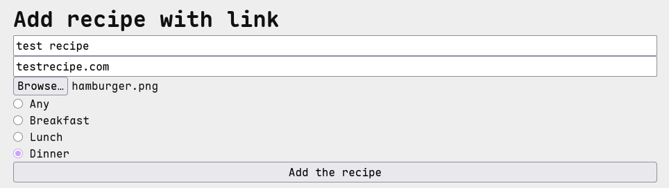
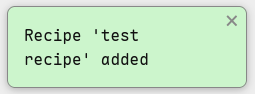
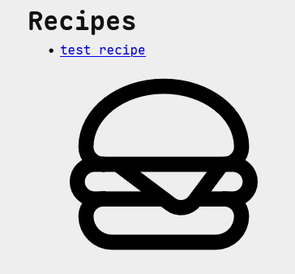
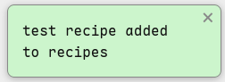
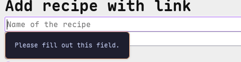
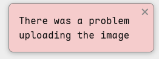
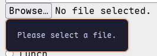

# Sprint 2 - Implement Database and Display of Test Data

## Sprint Goals

Implement the database, populated with test data. Create queries that retrieve test data, and display this on web pages as needed. Test and refine the queries and data display, so that it stands as the basis of the next sprint.

### Specific Goals

- Implement the database
- Add test data to the database
- Create the following web pages:
    - Home pages showing...
    - Details page for ...
    - Etc.
- Develop SQL database queries to:
    - Retrieve all ...
    - Retrieve specific ...
    - Etc.

## Testing Database initialization
I tested whether the SQLite database initializes correctly when the application is started using 
docker compose. I checked that all required tables were created and that the database was populated
with the expected seed data.

### How I tested it:
I ran:
docker compose up
THen I checked the terminal output to make sure there were no database 
initialization errors and that seed data was present.

Expected outcome:
The database should initialize successfully without errors and be populated with seed data.

Actual outcome:

Database schema

Database seeded data

## Testing User Registration and login 
Testing the ability for a user to make an account and log in. 

### How I tested it:
I opened the sign-up page and entered:

    Email: user@test.com
    Username: user
    Password: 1234

I then clicked Add user.

### Expected result:
The account should be created and the user should be redirected to the login page with a confirmation message.

Actual outcome:
#### Entering test data

#### Confirmation of sign up

#### Entering test data to login 

#### Confirmation of login with flash message and nav showing username

## Testing duplicate email registration
Testing whether the application prevents a second account from being 
created using an email address that already exists.

How I tested it:
I attempted to create another account using:

    Email: user@test.com
    Username: anotheruser
    Password: 1234

Expected result:
The account should not be created. The application should display an error message stating that an account using the email address already exists.

Actual outcome:

## Testing Household Creation

I am testing household creation, more specifically:
- logged-in user can open the join/create household page
- household name is required
- unique six-digit join code is generated
- household is inserted into the database
- creator is automatically added as an owner
- session is updated with the household information

to do this I logged in as a test user then clicked the house holds button in the navbar from 
here I entered testhouse as the household name and clicked submit from there I checked the 
navbar as well and the confirmation flash message to confirm test user is in a household 

#### Entering test data

#### Confirmation of household creation

### Changes / Improvements

#### Removed quotation marks around household name in confirmation flash

## Testing recipe creation and image upload

I am testing the creation of a recipe:
- The page opens
- data can be entered
- recipe is saved to database
- image can be uploaded
- 

to do this I logged in as a test user went to the add recipe page then entered the test data

- name: test recipe
- link:testrecipe.com
- image: hamburger.png 

- meal type: dinner

#### Entering test data

#### Confirmation of recipe creation

### Changes / Improvements

#### Removed quotation marks around household name in flash and reworded confirmation flash message

#### Changed name of link input in html form from Link to link

## Testing recipe creation and image upload

I am testing the creation of a recipe:
- The page opens
- data can be entered
- recipe is saved to database
- image can be uploaded

to do this I logged in as a test user went to the add recipe page then entered the test data

- name: test recipe
- link:testrecipe.com
- image: hamburger.png 

- meal type: dinner

#### Entering test data

#### Confirmation of recipe creation

### Changes / Improvements

#### Removed quotation marks around household name in flash and reworded confirmation flash message

#### Changed name of link input in html form from Link to link

## Testing image creation with non ideal test data

Testing what happens when test data is not expected data
- No title
- No url
- No image

#### Form is not submitted if title or url are missing

#### Form is submitted but error is shown

### Changes / Improvements

- Changed form so it will not submit when there is no image 

## Recipe retrieval and display

Testing whether list of recipes is displasyed correctly and if individual recipe's
details are displayed correctly  

## Sprint Review

Replace this text with a statement about how the sprint has moved the project forward - key success point, any things that didn't go so well, etc.

