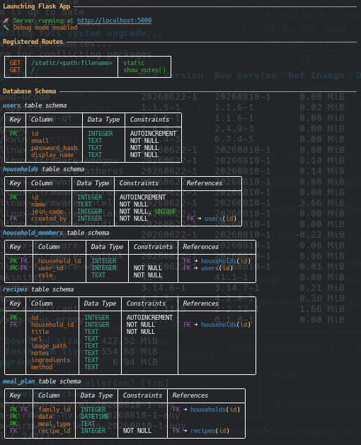
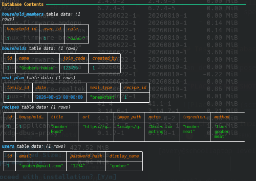
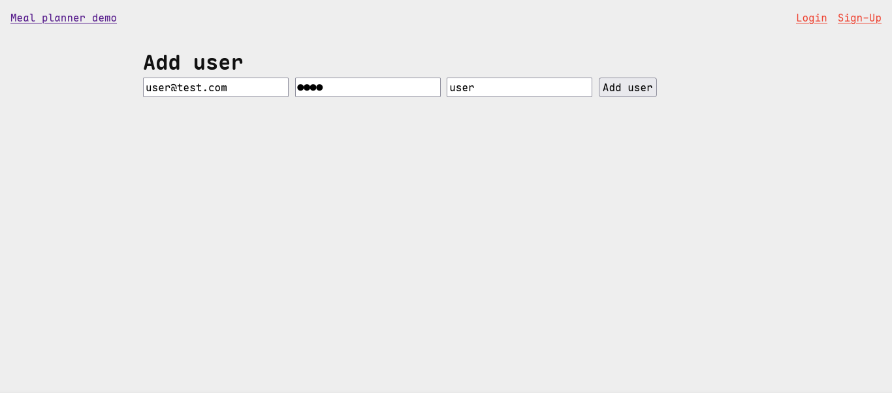
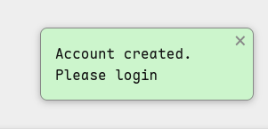
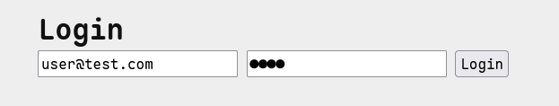
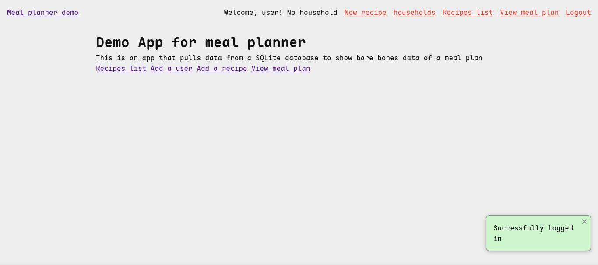
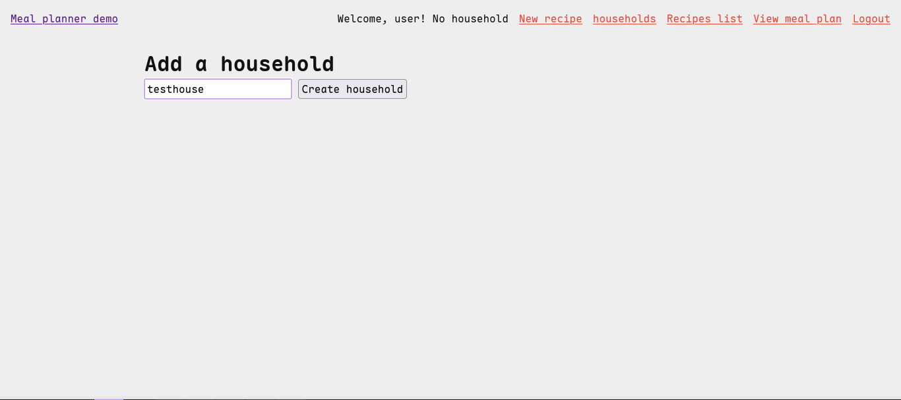
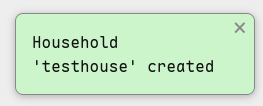
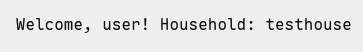

# Sprint 2 - Implement Database and Display of Test Data

## Sprint Goals

Implement the database, populated with test data. Create queries that retrieve test data, and display this on web pages as needed. Test and refine the queries and data display, so that it stands as the basis of the next sprint.

### Specific Goals

- Implement the database
- Add test data to the database
- Create the following web pages:
    - Home pages showing...
    - Details page for ...
    - Etc.
- Develop SQL database queries to:
    - Retrieve all ...
    - Retrieve specific ...
    - Etc.

## Testing Database initialization

Ran docker compose up to test whether the DB initializes correctly with all tables and seed data

Database schema

Database seeded data

## Testing User Registration and login 

Replace this text with notes about what you are testing, how you tested it, and the outcome of the testing
Testing the ability for a user to make an account and log in. I opened the user sign up form and then entered 
an email, username and password and then clicked the add user button. 
After this I logged in and then checked whether the nav bar shows that I am logged in

Test data: 
- Email - user@test.com
- Password - 1234
- username - user

#### Entering test data

#### Confirmation of sign up

#### Entering test data to login 

#### Confirmation of login with flash message and nav showing username

## Testing Household Creation

Replace this text with notes about what you are testing, how you tested it, and the outcome of the testing

I am testing household creation, more specifically:
- logged-in user can open the household page.
- household name is required.
- unique six-digit join code is generated.
- household is inserted into the database.
- creator is automatically added as an owner.
- session is updated with the household information.

to do this I logged in as a test user then clicked the house holds button in the navbar from 
here I entered testhouse as the household name and clicked submit from there I checked the 

#### Entering test data

#### Confirmation of household creation

### Changes / Improvements

Replace this text with notes any improvements you made as a result of the testing.

#### Removed quotation marks around household name in confirmation flash

## ETC...

## Sprint Review

Replace this text with a statement about how the sprint has moved the project forward - key success point, any things that didn't go so well, etc.

