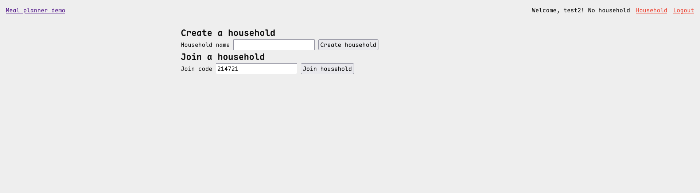
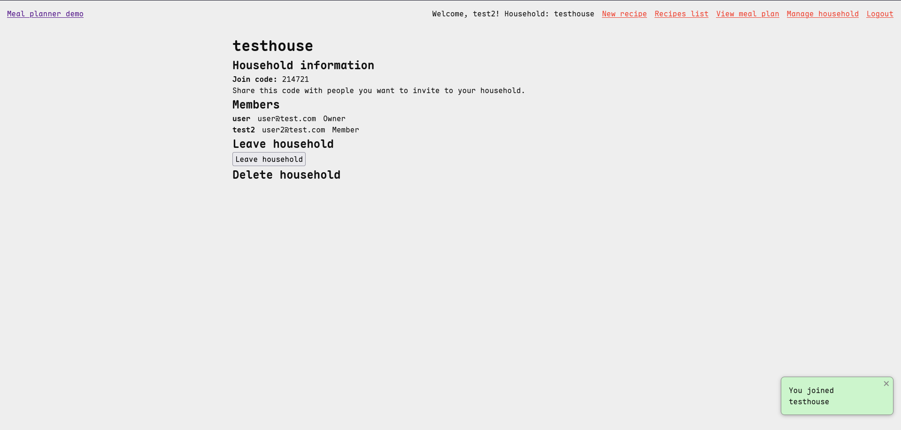
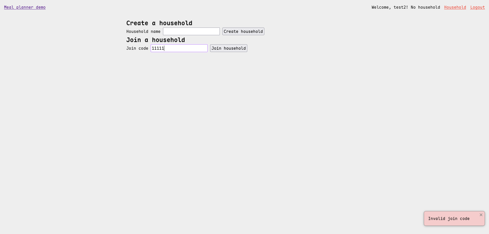
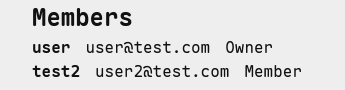
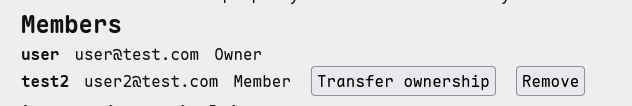

# Sprint 3 - Developing a Minimum Viable Product (MVP)

## Sprint Goals

Continue to develop the web application to the point that it provides all key 
functionality of the system. Test and refine it so that it can serve as the basis 
for the final phase of development.

### Specific Goals

- Create the following web pages:
    - Form for ...
    - Etc.
- Develop SQL database queries to:
    - Add a new ...
    - Etc.

## Testing Household management    

I will test the household management functionality to ensure that users can 
interact with households after the basic household creation functionality 
implemented in Sprint 2

Testing will include:

- Joining an existing household using a join code.
- Entering an invalid join code.
- Displaying household members.
- Removing household members where as owner.
- Transferring household ownership as owner.
- Leaving a household.

Expected outcome:

Users should be able to join and manage their household according to their permissions. 
Invalid actions should be prevented and the application should provide clear feedback 
when an action cannot be completed.

Actual outcome

#### Joining household with join code

#### Entering invalid join code 

#### Displaying household members

##### As member

##### As owner

#### Removing household members

##### As member

#### Transferring household ownership as owner not as member

#### Leaving a household

### Changes / Improvements

Replace this text with notes any improvements you made as a result of the testing.

## Testing FEATURE NAME HERE

Replace this text with notes about what you are testing, how you tested it, and the outcome of the testing

**PLACE SCREENSHOTS AND/OR ANIMATED GIFS OF THE TESTING HERE**

### Changes / Improvements

Replace this text with notes any improvements you made as a result of the testing.

**PLACE SCREENSHOTS AND/OR ANIMATED GIFS OF THE IMPROVED SYSTEM HERE**

## Testing FEATURE NAME HERE

Replace this text with notes about what you are testing, how you tested it, and the outcome of the testing

**PLACE SCREENSHOTS AND/OR ANIMATED GIFS OF THE TESTING HERE**

### Changes / Improvements

Replace this text with notes any improvements you made as a result of the testing.

**PLACE SCREENSHOTS AND/OR ANIMATED GIFS OF THE IMPROVED SYSTEM HERE**

## ETC...

## Sprint Review

Replace this text with a statement about how the sprint has moved the project forward - key success point, any things that didn't go so well, etc.

